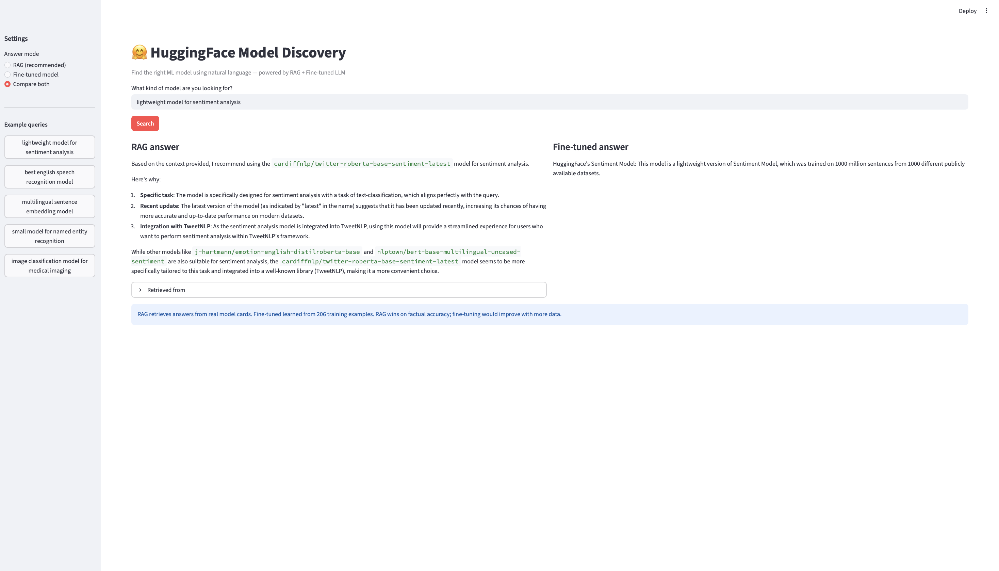

# HuggingFace Model Discovery System

Natural language search for ML models — built on 492 HuggingFace model cards using RAG, fine-tuning, and LLM evaluation.



## What it does

Ask in plain English: *"lightweight model for sentiment analysis on social media"* — get a specific, grounded model recommendation with reasoning pulled directly from real HuggingFace model cards.

## Architecture
```
HuggingFace Hub (492 model cards)
        │
        ├── RAG Track
        │     ├── Chunk & embed (all-MiniLM-L6-v2)
        │     ├── Vector store (ChromaDB, 12,267 chunks)
        │     └── LLM answer generation (Llama 3.2 via Ollama)
        │
        └── Fine-tuning Track
              ├── Q&A pair generation (206 pairs via Llama 3.2)
              ├── LoRA fine-tuning (TinyLlama-1.1B, 0.2% trainable params)
              └── Evaluation vs RAG vs base model
```

## Key findings

| Approach | Factual accuracy | Speed | Best for |
|---|---|---|---|
| RAG | High — grounded in real cards | ~3-5s | Specific model lookup |
| Fine-tuned | Medium — learned style, not facts | ~5-8s | Domain tone, style |
| Base model | Low — generic answers | ~5-8s | Nothing task-specific |

**RAG outperforms fine-tuning for this task.** When the goal is factual retrieval from a specific knowledge base, RAG wins. Fine-tuning would close the gap with 10x more training data.

## Stack

- **Data**: `huggingface_hub`, pandas, LangChain text splitter
- **Embeddings**: `sentence-transformers` (all-MiniLM-L6-v2)
- **Vector DB**: ChromaDB (local, persistent)
- **Fine-tuning**: TinyLlama-1.1B + LoRA via HuggingFace PEFT
- **LLM inference**: Llama 3.2 via Ollama (fully local, no API costs)
- **Evaluation**: side-by-side comparison across 5 test queries
- **UI**: Streamlit

## Run locally
```bash
# 1. Install dependencies
pip install -r requirements.txt

# 2. Start Ollama
ollama serve  # separate terminal

# 3. Run the pipeline (first time only)
python src/fetch_models.py
python src/fetch_cards.py
python src/clean_cards.py
python src/chunk_cards.py
python src/build_vectorstore.py

# 4. Launch the app
streamlit run src/app.py
```

## Project structure
```
hf-model-discovery/
├── data/                    # parquet files + chroma vector store
├── models/                  # LoRA fine-tuned weights
├── src/
│   ├── fetch_models.py      # pull model metadata
│   ├── fetch_cards.py       # pull model card text
│   ├── clean_cards.py       # clean + filter
│   ├── chunk_cards.py       # split into chunks
│   ├── build_vectorstore.py # embed + store in Chroma
│   ├── generate_qa_pairs.py # generate fine-tuning data
│   ├── rag_query.py         # RAG query engine
│   ├── evaluate.py          # compare all three approaches
│   └── app.py               # Streamlit UI
└── README.md
```